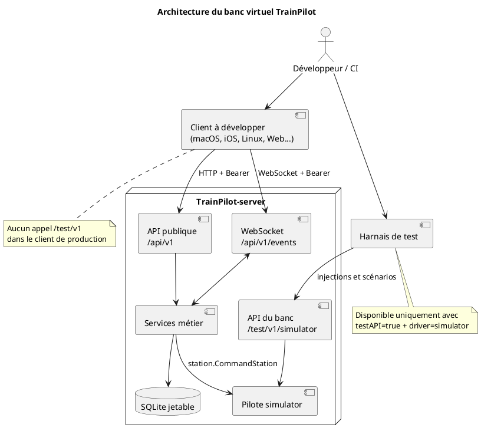
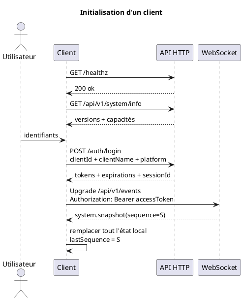
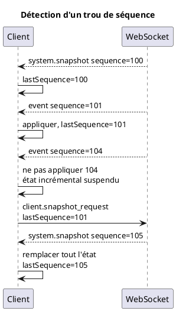
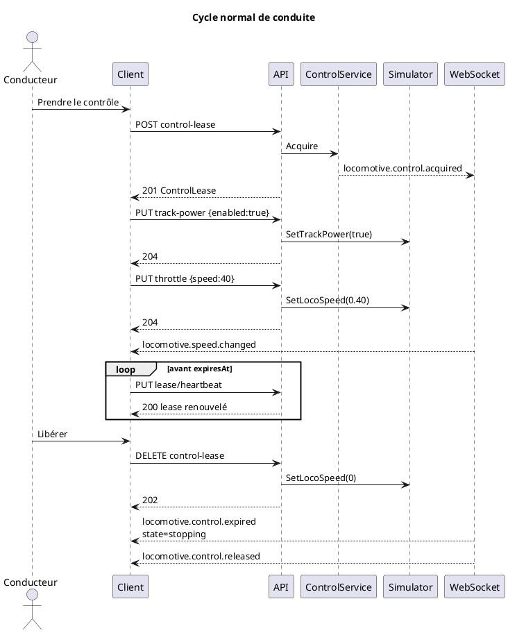
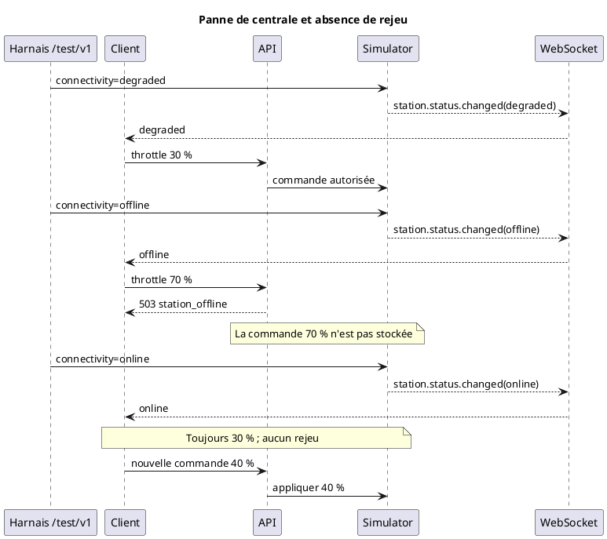
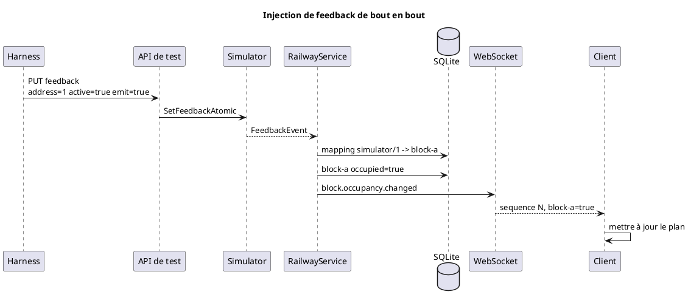
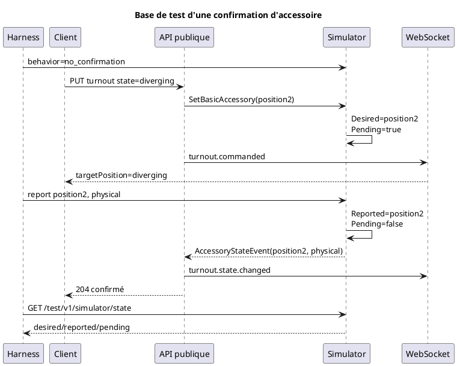
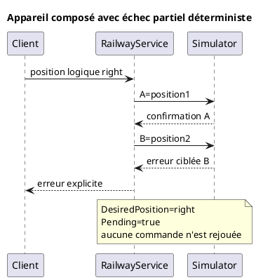
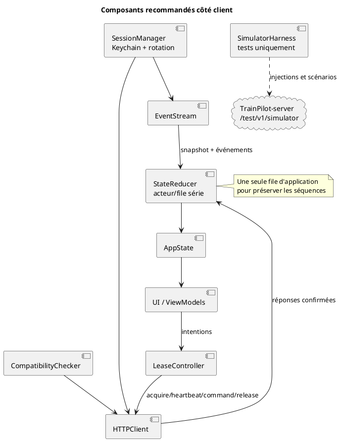
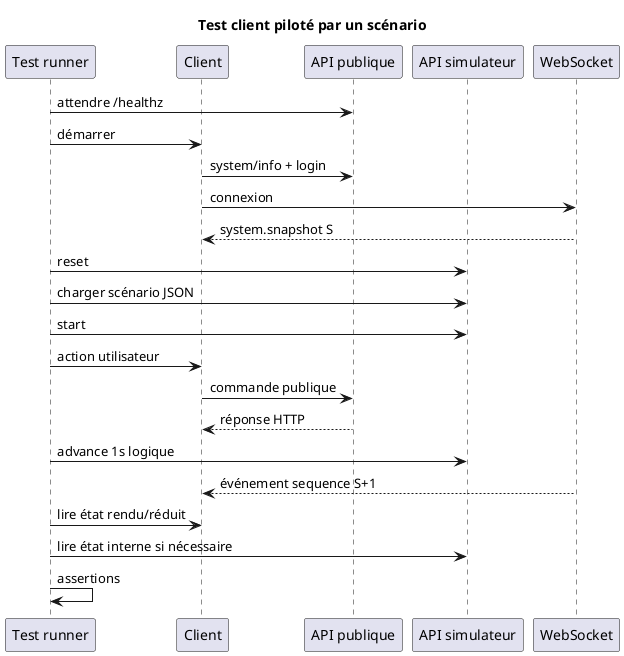

# Développer un client TrainPilot avec le simulateur

Dernière validation : 31 août 2026.

Versions du contrat au moment de cette validation :

- serveur : `0.2.0` ;
- API HTTP : `1.6.0` ;
- API événementielle : `1.8.0` ;
- format des scénarios du simulateur : `1`.

Ce guide explique comment utiliser TrainPilot-server comme banc virtuel pour
développer et tester un client macOS, iOS, Linux, Web ou autre, sans centrale
DCC réelle. Il est livré dans les archives du serveur et doit être mis à jour
avec toute évolution de la configuration, de l'API de test, des scénarios ou
des comportements client décrits ici.

Les contrats normatifs restent :

- [`api/openapi.yaml`](../api/openapi.yaml) pour HTTP ;
- [`api/asyncapi.yaml`](../api/asyncapi.yaml) pour le WebSocket ;
- [`SIMULATOR_TEST_API.md`](SIMULATOR_TEST_API.md) pour l'API réservée aux tests ;
- les fichiers de [`tests/simulator/scenarios/`](../tests/simulator/scenarios/)
  pour les scénarios reproductibles.

En cas d'écart, le code, les tests et ces contrats machine-readable priment sur
les exemples du présent guide.

## 1. Ce que le simulateur permet de développer

Le simulateur implémente la même abstraction de centrale que z21 et DCC-EX. Un
client utilise donc les mêmes routes publiques et les mêmes événements qu'avec
une centrale réelle.

Il permet de tester de manière déterministe :

- l'authentification, le refresh et le logout ;
- la découverte des versions et capacités du serveur ;
- le snapshot WebSocket initial et la resynchronisation ;
- la bibliothèque de locomotives ;
- l'acquisition exclusive, le heartbeat, la libération et le takeover d'un
  lease ;
- la vitesse, le sens et les fonctions F0 à F68 ;
- la puissance et l'arrêt d'urgence ;
- les états `online`, `degraded` et `offline` ;
- le refus d'une commande hors ligne et l'absence de rejeu ;
- les cantons et la rétrosignalisation ;
- les aiguillages et les bases de confirmation physique ;
- les courants, tensions, températures et défauts électriques ;
- les délais et erreurs injectés par type d'opération ;
- les séquences d'événements, les rebonds et les événements volontairement
  perdus ;
- des scénarios linéaires rejouables sans attendre leur durée en temps réel.

Le simulateur n'est pas un modèle physique de train. Il ne calcule ni distance,
ni inertie, ni consommation, ni température à partir de la vitesse. Il ne
simule pas les paquets z21 ou les trames DCC-EX. Il ne programme pas les CV et
n'exécute aucune logique de topologie, de signalisation ou de localisation.

## 2. Architecture du banc de développement

Le client en cours de développement ne doit connaître aucun concept propre au
simulateur. Un harnais de test séparé pilote le monde virtuel par `/test/v1`.



Cette séparation garantit qu'un test agit comme le monde extérieur, tandis que
le client observe les conséquences par les mécanismes normaux du serveur.

## 3. Préparer une instance jetable

### 3.1 Configuration recommandée

Utiliser une base SQLite et un socket d'administration dédiés au développement.
Ne jamais réutiliser une base de production.

Exemple `client-simulator.json` :

```json
{
  "http": {
    "listen": "127.0.0.1:8080",
    "tlsCert": "",
    "tlsKey": ""
  },
  "admin": {
    "socket": "/tmp/trainpilot-client-simulator-admin.sock",
    "mode": 432
  },
  "database": {
    "path": "/tmp/trainpilot-client-simulator.db"
  },
  "station": {
    "driver": "simulator",
    "offlineAfter": "10s"
  },
  "turnout": {
    "confirmationTimeout": "2s"
  },
  "security": {
    "accessTokenTTL": "15m",
    "refreshTokenTTL": "720h"
  },
  "control": {
    "leaseTTL": "10m",
    "stopGrace": "2s",
    "monitorPeriod": "250ms"
  },
  "testAPI": true,
  "seedDemo": true
}
```

Points importants :

- `station.driver=simulator` sélectionne le pilote virtuel ;
- `testAPI=true` enregistre les routes du banc ;
- les deux conditions sont obligatoires ;
- `seedDemo=true` crée deux locomotives, trois cantons, un aiguillage, un
  itinéraire et un mapping de feedback de démonstration ;
- le serveur n'expose jamais les routes de test avec z21 ou DCC-EX ;
- `testAPI` doit rester désactivé dans une configuration de production ;
- pour exécuter plusieurs suites en parallèle, chaque processus doit utiliser
  un port, une base et un socket d'administration distincts.

Le fichier `config.json` du dépôt est déjà adapté à un développement local avec
le simulateur. Une copie dédiée évite toutefois de mélanger les données de deux
tests.

### 3.2 Démarrer le serveur

Depuis les sources :

```bash
go run ./cmd/dccd serve --config client-simulator.json
```

Depuis une archive de livraison :

```bash
./bin/dccd serve --config client-simulator.json
```

Vérifier la disponibilité sans authentification :

```bash
curl -sS http://127.0.0.1:8080/healthz
```

Réponse :

```json
{"status":"ok"}
```

### 3.3 Créer les utilisateurs

La gestion des utilisateurs n'est pas exposée sur l'API réseau. Elle passe par
le socket local d'administration.

Créer le premier administrateur :

```bash
printf '%s\n' 'correct-horse-admin' |
  go run ./cmd/dccd user bootstrap \
    --socket /tmp/trainpilot-client-simulator-admin.sock \
    --username admin \
    --display-name 'Administrateur' \
    --role administrator \
    --password-stdin
```

Créer ensuite un conducteur et un dispatcher :

```bash
printf '%s\n' 'correct-horse-driver' |
  go run ./cmd/dccd user add \
    --socket /tmp/trainpilot-client-simulator-admin.sock \
    --username alice \
    --display-name 'Alice' \
    --role driver \
    --password-stdin

printf '%s\n' 'correct-horse-dispatch' |
  go run ./cmd/dccd user add \
    --socket /tmp/trainpilot-client-simulator-admin.sock \
    --username dispatcher \
    --display-name 'Dispatcher' \
    --role dispatcher \
    --password-stdin
```

Matrice des permissions :

| Rôle | Lecture | Conduite | Aiguillages/itinéraires | Configuration/import |
| --- | --- | --- | --- | --- |
| `viewer` | oui | non | non | non |
| `driver` | oui | oui | non | non |
| `dispatcher` | oui | oui | oui | non |
| `administrator` | oui | oui | oui | oui |

Les routes `/test/v1/simulator/...` exigent actuellement seulement une session
authentifiée. Cette règle ne doit pas conduire le client de production à les
utiliser : elles appartiennent exclusivement au harnais de test.

## 4. Démarrage d'une session client

### 4.1 Vérifier les versions et capacités

Avant le login, appeler :

```bash
curl -sS http://127.0.0.1:8080/api/v1/system/info
```

Exemple :

```json
{
  "serverVersion": "0.2.0",
  "apiVersion": "1.6.0",
  "minimumClientApiVersion": "1.0.0",
  "eventApiVersion": "1.8.0",
  "minimumClientEventApiVersion": "1.3.0",
  "station": {
    "driver": "simulator",
    "trackPower": true,
    "locomotiveControl": true,
    "functions": 69,
    "maxFunctionNumber": 68,
    "accessoryControl": true,
    "feedback": true
  }
}
```

Le client doit :

1. vérifier que sa version HTTP est comprise entre la version minimale et la
   version courante annoncées ;
2. faire la même vérification pour le contrat événementiel ;
3. construire son interface depuis les capacités, sans supposer qu'un autre
   pilote possède celles du simulateur ;
4. considérer `functions` comme un nombre de fonctions et
   `maxFunctionNumber` comme la borne inclusive réellement acceptée.

### 4.2 Login

`clientId` est obligatoire. Il doit identifier de manière stable une
installation du client, par exemple un UUID conservé dans les préférences.
`clientName` est lisible par l'humain et `platform` facilite le diagnostic.

```bash
curl -sS http://127.0.0.1:8080/api/v1/auth/login \
  -H 'Content-Type: application/json' \
  -d '{
    "username": "alice",
    "password": "correct-horse-driver",
    "clientId": "8E2878C1-4718-49F3-A160-6AA6B67A9E25",
    "clientName": "TrainPilot macOS développement",
    "platform": "macOS"
  }'
```

Réponse abrégée :

```json
{
  "accessToken": "...",
  "refreshToken": "...",
  "accessExpiresAt": "2026-08-31T12:15:00Z",
  "refreshExpiresAt": "2026-09-30T12:00:00Z",
  "sessionId": "session-uuid",
  "user": {
    "id": "user-uuid",
    "username": "alice",
    "displayName": "Alice",
    "role": "driver",
    "enabled": true,
    "mustChangePassword": false,
    "createdAt": "2026-08-31T10:00:00Z",
    "updatedAt": "2026-08-31T10:00:00Z"
  }
}
```

Tous les appels protégés utilisent :

```http
Authorization: Bearer <accessToken>
```

Le mot de passe ne doit pas être conservé. Sur Apple, stocker le refresh token
dans le Keychain. L'access token peut rester en mémoire ou dans un stockage de
même niveau de protection.

### 4.3 Refresh, rotation et logout

```bash
curl -sS http://127.0.0.1:8080/api/v1/auth/refresh \
  -H 'Content-Type: application/json' \
  -d '{"refreshToken":"<refreshToken courant>"}'
```

Le refresh fait tourner les deux tokens. Dès le succès :

- remplacer atomiquement access token, refresh token et dates d'expiration ;
- ne plus réutiliser les anciens tokens ;
- rouvrir le WebSocket avec le nouvel access token ;
- conserver le même `sessionId`.

Logout :

```bash
curl -i -X POST http://127.0.0.1:8080/api/v1/auth/logout \
  -H 'Authorization: Bearer <accessToken>'
```

Le logout révoque la session et ferme son WebSocket. Il ne libère pas
instantanément les leases : ceux-ci restent soumis à leur heartbeat et à leur
expiration sûre.



## 5. Surface publique utile au client

L'OpenAPI reste la définition détaillée des corps et réponses. Cette table sert
d'inventaire de mise en œuvre.

| Méthode et route | Usage principal | Permission |
| --- | --- | --- |
| `GET /healthz` | disponibilité du processus | publique |
| `GET /api/v1/system/info` | versions et capacités | publique |
| `POST /api/v1/auth/login` | créer une session | publique |
| `POST /api/v1/auth/refresh` | faire tourner les tokens | publique |
| `POST /api/v1/auth/logout` | révoquer la session | authentifié |
| `GET /api/v1/me` | utilisateur courant | lecture |
| `GET /api/v1/station/status` | connectivité, puissance, défauts, télémétrie | lecture |
| `GET /api/v1/track-power` | alias historique du statut complet | lecture |
| `PUT /api/v1/track-power` | puissance on/off | conduite |
| `POST /api/v1/emergency-stop` | arrêt d'urgence global | conduite |
| `GET /api/v1/locomotives` | bibliothèque | lecture |
| `GET /api/v1/locomotives/{id}` | détail d'une locomotive | lecture |
| `POST/PUT/DELETE /api/v1/locomotives...` | gérer la bibliothèque | administration |
| `POST /api/v1/locomotives/{id}/control-lease` | acquérir le contrôle | conduite |
| `PUT /api/v1/control-leases/{id}/heartbeat` | renouveler le lease | propriétaire |
| `POST /api/v1/control-leases/{id}/takeover` | takeover même utilisateur | conduite |
| `DELETE /api/v1/control-leases/{id}` | arrêt contrôlé puis libération | propriétaire |
| `PUT /api/v1/locomotives/{id}/throttle` | vitesse et sens | propriétaire |
| `PUT /api/v1/locomotives/{id}/functions/{n}` | fonction DCC | propriétaire |
| `GET /api/v1/blocks` | cantons et occupation | lecture |
| `GET /api/v1/turnouts` | aiguillages | lecture |
| `PUT /api/v1/turnouts/{id}` | commander un aiguillage | dispatch |
| `GET /api/v1/routes` | itinéraires | lecture |
| `POST /api/v1/routes/{id}/reserve` | réserver | dispatch |
| `POST /api/v1/routes/{id}/activate` | activer | dispatch |
| `POST /api/v1/routes/{id}/release` | libérer | dispatch |
| routes d'import/export | archives parc et réseau | selon OpenAPI |
| `GET /api/v1/events` | snapshot et événements | authentifié |

## 6. WebSocket et modèle de synchronisation

### 6.1 Ouverture

URL locale :

```text
ws://127.0.0.1:8080/api/v1/events
```

Le handshake doit contenir l'en-tête Bearer. Avec `websocat` :

```bash
websocat \
  -H='Authorization: Bearer <accessToken>' \
  ws://127.0.0.1:8080/api/v1/events
```

Avec `URLSessionWebSocketTask` :

```swift
var request = URLRequest(url: URL(string: "ws://127.0.0.1:8080/api/v1/events")!)
request.setValue("Bearer \(accessToken)", forHTTPHeaderField: "Authorization")

let task = URLSession.shared.webSocketTask(with: request)
task.resume()
```

Limitation Web actuelle : l'API ne publie pas d'en-têtes CORS et
`WebSocket` côté navigateur ne permet pas d'ajouter `Authorization`. Un client
Web exécuté dans un navigateur doit donc passer par un proxy/BFF de même origine
qui ajoute l'en-tête, ou attendre une évolution explicite du contrat. Le token
en query string n'est pas pris en charge et ne doit pas être inventé côté client.

### 6.2 Snapshot initial

Le premier message est toujours `system.snapshot` :

```json
{
  "type": "system.snapshot",
  "sequence": 42,
  "capturedAt": "2026-08-31T12:00:00Z",
  "payload": {
    "station": {},
    "stationStatus": {},
    "locomotives": [],
    "controlLeases": [],
    "locomotiveControlStates": [],
    "blocks": [],
    "turnouts": [],
    "routes": []
  }
}
```

Le client doit remplacer son état local complet par ce snapshot. Les tableaux
sont présents même lorsqu'ils sont vides.

`controlLeases` contient uniquement les leases complets appartenant à la
session authentifiée. `locomotiveControlStates` contient l'occupation publique
de toutes les locomotives contrôlées :

| Présence/état | Signification client |
| --- | --- |
| aucune entrée pour la locomotive | libre |
| `active + mine` | contrôlée par cette session |
| `active + same_user_other_session` | autre session du même utilisateur |
| `active + other` | autre utilisateur |
| `stopping + ...` | arrêt/libération en cours, acquisition impossible |

Ne jamais déduire la disponibilité depuis `controlLeases` seul.

### 6.3 Séquences et resynchronisation

Chaque événement serveur possède `type`, `sequence`, `timestamp` et `payload`.
Algorithme recommandé :

1. à réception du snapshot, mémoriser `lastSequence=snapshot.sequence` ;
2. ignorer tout événement `sequence <= lastSequence` ;
3. appliquer un événement seulement si `sequence == lastSequence + 1` ;
4. si `sequence > lastSequence + 1`, suspendre l'application incrémentale et
   envoyer `client.snapshot_request` ;
5. remplacer l'état avec le nouveau snapshot et reprendre depuis sa séquence ;
6. en cas de fermeture, se reconnecter et repartir du nouveau snapshot.

Demande de snapshot :

```json
{
  "type": "client.snapshot_request",
  "lastSequence": 47
}
```

Heartbeat WebSocket facultatif :

```json
{"type":"client.heartbeat"}
```

Ce heartbeat ne prolonge ni le token d'accès, ni un lease, et ne consomme pas
de séquence serveur.



Le serveur ne conserve aucun replay. Une file de 64 événements est associée à
chaque connexion. Un débordement ou une écriture dépassant cinq secondes ferme
la connexion afin d'imposer une resynchronisation complète.

### 6.4 Événements à prendre en charge

| Type | Mise à jour locale attendue |
| --- | --- |
| `station.status.changed` | connectivité et `lastSeen` |
| `track.power.changed` | puissance |
| `track.emergency_stop` | interlock d'arrêt d'urgence |
| `locomotive.created/updated/deleted` | bibliothèque |
| `locomotive.control.acquired` | occupation et lease si propriétaire |
| `locomotive.control.transferred` | ownership et lease transféré |
| `locomotive.control.expired` | état `stopping`, arrêter les commandes |
| `locomotive.control.released` | locomotive libre |
| `locomotive.speed.changed` | dernière commande confirmée par le serveur |
| `locomotive.function.changed` | fonction confirmée |
| `block.occupancy.changed` | occupation du canton |
| `turnout.commanded` | cible logique acceptée, afficher `pending` |
| `turnout.state.changed` | desired/reported, qualité et résultat courant |
| `turnout.command.failed` | cible non confirmée et raison publique |
| `route.reserved/activated/released` | état de l'itinéraire |
| `rolling-stock.imported` | recharger la bibliothèque concernée |
| `layout.imported` | recharger le réseau concerné |

Le client doit tolérer un type futur inconnu, le journaliser, puis continuer en
respectant sa séquence. Une modification incompatible du contrat doit être
détectée auparavant via `/api/v1/system/info`.

## 7. Conduite et leases

### 7.1 Acquisition

```bash
curl -sS -X POST \
  http://127.0.0.1:8080/api/v1/locomotives/loco-bb26001/control-lease \
  -H 'Authorization: Bearer <accessToken>'
```

Réponse `201 Created` :

```json
{
  "id": "lease-uuid",
  "locomotiveId": "loco-bb26001",
  "userId": "user-uuid",
  "sessionId": "session-uuid",
  "state": "active",
  "acquiredAt": "2026-08-31T12:00:00Z",
  "renewedAt": "2026-08-31T12:00:00Z",
  "expiresAt": "2026-08-31T12:10:00Z",
  "heartbeatMillis": 200000
}
```

Utiliser `heartbeatMillis` retourné par le serveur pour planifier le heartbeat,
et `expiresAt` comme borne de sécurité. Ne pas coder en dur la durée du lease.

### 7.2 Commandes

Activer explicitement la puissance :

```bash
curl -i -X PUT http://127.0.0.1:8080/api/v1/track-power \
  -H 'Authorization: Bearer <accessToken>' \
  -H 'Content-Type: application/json' \
  -d '{"enabled":true}'
```

Throttle :

```bash
curl -i -X PUT \
  http://127.0.0.1:8080/api/v1/locomotives/loco-bb26001/throttle \
  -H 'Authorization: Bearer <accessToken>' \
  -H 'Content-Type: application/json' \
  -d '{"leaseId":"lease-uuid","speed":40,"direction":"forward"}'
```

Fonction F0 :

```bash
curl -i -X PUT \
  http://127.0.0.1:8080/api/v1/locomotives/loco-bb26001/functions/0 \
  -H 'Authorization: Bearer <accessToken>' \
  -H 'Content-Type: application/json' \
  -d '{"leaseId":"lease-uuid","enabled":true}'
```

Un throttle ou une fonction accepté renouvelle aussi le lease. Le client doit
néanmoins maintenir son heartbeat lorsque l'utilisateur ne commande rien.

Heartbeat :

```bash
curl -sS -X PUT \
  http://127.0.0.1:8080/api/v1/control-leases/lease-uuid/heartbeat \
  -H 'Authorization: Bearer <accessToken>'
```

Libération :

```bash
curl -i -X DELETE \
  http://127.0.0.1:8080/api/v1/control-leases/lease-uuid \
  -H 'Authorization: Bearer <accessToken>'
```

La réponse est `202 Accepted`. Le serveur commande zéro, passe le lease en
`stopping`, puis le libère après la grâce configurée. Le client doit attendre
`locomotive.control.released` avant d'afficher la locomotive comme libre.



### 7.3 Takeover explicite

Si `locomotiveControlStates` indique `same_user_other_session`, le client peut
proposer une action explicite de reprise :

```bash
curl -sS -X POST \
  http://127.0.0.1:8080/api/v1/control-leases/lease-uuid/takeover \
  -H 'Authorization: Bearer <accessToken de la nouvelle session>'
```

Le serveur arrête la locomotive à zéro, conserve le même `leaseId`, transfère
le lease atomiquement et publie `locomotive.control.transferred`. L'ancienne
session doit arrêter immédiatement heartbeats et commandes. Un lease d'un
autre utilisateur ne peut jamais être repris.

## 8. Santé de la centrale et sécurité du client

### 8.1 Sémantique

| Connectivité | Commandes | Affichage recommandé |
| --- | --- | --- |
| `online` | autorisées selon les autres règles | normal |
| `degraded` | autorisées | avertissement visible |
| `offline` | refusées | commandes désactivées |

Une commande hors ligne retourne `503` avec `code=station_offline`. Une
commande refusée n'est jamais mise en file par le serveur et ne sera jamais
rejouée lors du retour `online`. Le client ne doit pas créer sa propre file de
rejeu automatique pour throttle, fonctions ou accessoires.

Après un arrêt d'urgence, les vitesses positives et les fonctions restent
refusées jusqu'à un `PUT /track-power {"enabled":true}` explicite réussi.

### 8.2 Scénario de panne sans rejeu



## 9. API de contrôle du simulateur

Toutes ces routes exigent un access token, mais elles doivent être appelées par
le harnais de test et non par le code fonctionnel du client.

| Méthode et route | Effet |
| --- | --- |
| `GET /test/v1/simulator/state` | snapshot interne complet |
| `POST /test/v1/simulator/reset` | reset du pilote et déchargement du scénario |
| `PUT /test/v1/simulator/connectivity` | `online/degraded/offline` |
| `PUT /test/v1/simulator/electrical` | télémétrie et défauts |
| `PUT /test/v1/simulator/feedback` | état physique avec ou sans événement |
| `PUT /test/v1/simulator/accessories/{address}/reported-position` | retour d'endpoint qualifié |
| `PUT /test/v1/simulator/accessories/{address}/behavior` | mode de confirmation |
| `PUT /test/v1/simulator/faults/{operation}` | délai/erreur déterministe |
| `DELETE /test/v1/simulator/faults` | effacer les faults |
| `POST /test/v1/simulator/scenarios` | charger un JSON v2, avec lecture v1 compatible |
| `POST /test/v1/simulator/scenarios/start` | démarrer en mode manuel |
| `POST /test/v1/simulator/scenarios/advance` | avancer le temps logique |
| `POST /test/v1/simulator/scenarios/stop` | arrêter le scénario |

Les corps JSON sont limités à 1 Mio, refusent les champs inconnus et doivent
contenir exactement une valeur JSON.

### 9.1 Snapshot interne

```bash
curl -sS http://127.0.0.1:8080/test/v1/simulator/state \
  -H 'Authorization: Bearer <accessToken>'
```

Exemple abrégé :

```json
{
  "connected": true,
  "connectivity": "online",
  "lastSeen": "2026-08-31T12:00:00Z",
  "trackPower": true,
  "emergencyStop": false,
  "locomotives": {
    "2601": {
      "speed": 0.4,
      "direction": "forward",
      "functions": {"0": true}
    }
  },
  "accessories": {},
  "accessoryBehaviors": {},
  "electrical": {
    "mainCurrentMilliAmps": 0,
    "programmingCurrentMilliAmps": 0,
    "filteredMainCurrentMilliAmps": 0,
    "temperatureCelsius": 25,
    "supplyVoltageMilliVolts": 18000,
    "trackVoltageMilliVolts": 18000,
    "programmingMode": false,
    "highTemperature": false,
    "powerLost": false,
    "externalShortCircuit": false,
    "internalShortCircuit": false
  },
  "feedbackStates": [],
  "faults": {},
  "scenario": null
}
```

Ce snapshot est destiné aux assertions du test. Le client fonctionnel doit
continuer à utiliser le snapshot WebSocket et les routes publiques.

### 9.2 Reset et isolation

```bash
curl -i -X POST http://127.0.0.1:8080/test/v1/simulator/reset \
  -H 'Authorization: Bearer <accessToken>'
```

Le reset :

- conserve la connexion du pilote ;
- remet la connectivité à `online` si le pilote était connecté ;
- coupe la voie et efface l'arrêt d'urgence ;
- efface locomotives, fonctions, accessoires, feedbacks et faults ;
- arrête et décharge le scénario.

Il ne réinitialise pas SQLite. Les utilisateurs, leases, locomotives métier,
cantons, aiguillages, itinéraires et occupations déjà persistées restent dans
la base. Pour une isolation complète, utiliser une base SQLite neuve par test
ou nettoyer les ressources via l'API publique.

Charger un nouveau scénario arrête l'ancien, mais ne reset pas automatiquement
le simulateur. Appeler `/reset` avant chaque scénario indépendant.

### 9.3 Connectivité

```bash
curl -i -X PUT http://127.0.0.1:8080/test/v1/simulator/connectivity \
  -H 'Authorization: Bearer <accessToken>' \
  -H 'Content-Type: application/json' \
  -d '{"connectivity":"degraded"}'
```

La transition injectée met à jour `/station/status` et publie
`station.status.changed`. Le passage `online` rafraîchit `lastSeen`; les
passages `degraded` et `offline` ne le font pas artificiellement.

### 9.4 Télémétrie électrique

```bash
curl -i -X PUT http://127.0.0.1:8080/test/v1/simulator/electrical \
  -H 'Authorization: Bearer <accessToken>' \
  -H 'Content-Type: application/json' \
  -d '{
    "mainCurrentMilliAmps": 327,
    "programmingCurrentMilliAmps": 0,
    "filteredMainCurrentMilliAmps": 300,
    "temperatureCelsius": 42,
    "supplyVoltageMilliVolts": 17950,
    "trackVoltageMilliVolts": 17890,
    "programmingMode": false,
    "highTemperature": false,
    "powerLost": false,
    "externalShortCircuit": true,
    "internalShortCircuit": false
  }'
```

Les champs absents deviennent zéro. Envoyer l'état complet voulu. Aucun défaut
ne coupe automatiquement la voie : injecter aussi `track_power=false` dans un
scénario si le cas de test l'exige.

La télémétrie est visible par `GET /api/v1/station/status` et dans un nouveau
snapshot WebSocket. Il n'existe actuellement pas d'événement incrémental dédié
aux courants, tensions ou températures.

### 9.5 Feedback et cantons

```bash
curl -i -X PUT http://127.0.0.1:8080/test/v1/simulator/feedback \
  -H 'Authorization: Bearer <accessToken>' \
  -H 'Content-Type: application/json' \
  -d '{
    "source":"simulator",
    "kind":"occupancy",
    "address":1,
    "active":true,
    "emit":true
  }'
```

Avec `emit=true`, le chemin est complet : capteur, mapping, canton, SQLite,
événement WebSocket. Avec `emit=false`, seul l'état physique interne change ;
le service conserve son ancienne vision. C'est le scénario d'un événement
perdu.



Le traitement par `RailwayService` est asynchrone. Après une réponse `204` ou
un `scenario/advance`, attendre l'événement avec une échéance courte au lieu de
supposer qu'il a déjà été consommé.

`seedDemo=true` mappe par défaut `simulator/1` vers `block-a`. Les scénarios à
plusieurs capteurs nécessitent les mappings correspondants dans le réseau
importé. Le scénario CI `feedback-multiple-blocks` ajoute notamment le mapping
`simulator/2 -> block-b` dans sa fixture. Pour reproduire exactement ce cas
depuis un serveur autonome, importer un layout contenant ce second mapping ;
voir [`ARCHIVE_FORMAT.md`](ARCHIVE_FORMAT.md).

### 9.6 Accessoires

Modes disponibles :

| Mode | Comportement interne |
| --- | --- |
| `immediate` | `Reported=Desired`, `Pending=false` |
| `delayed` | confirmation après le délai configuré |
| `no_confirmation` | `Pending=true` sans retour spontané |
| `inconsistent` | retour explicitement différent |

Configurer une absence de confirmation :

```bash
curl -i -X PUT \
  http://127.0.0.1:8080/test/v1/simulator/accessories/1/behavior \
  -H 'Authorization: Bearer <accessToken>' \
  -H 'Content-Type: application/json' \
  -d '{"mode":"no_confirmation"}'
```

Commander l'aiguillage par l'API publique :

```bash
curl -i -X PUT http://127.0.0.1:8080/api/v1/turnouts/turnout-1 \
  -H 'Authorization: Bearer <token dispatcher>' \
  -H 'Content-Type: application/json' \
  -d '{"state":"diverging"}'
```

La requête publique attend la confirmation de toutes les étapes. Avec
`no_confirmation`, elle termine par `409 turnout_confirmation_timeout` après
`turnout.confirmationTimeout`. Pour injecter une confirmation avant cette
échéance, lancer la requête dans une tâche asynchrone du harnais, attendre
`turnout.commanded`, puis appeler l'API de test.

Injecter ensuite le retour :

```bash
curl -i -X PUT \
  http://127.0.0.1:8080/test/v1/simulator/accessories/1/reported-position \
  -H 'Authorization: Bearer <accessToken>' \
  -H 'Content-Type: application/json' \
  -d '{"position":"position2","quality":"physical"}'
```

L'état endpoint `Desired/Reported/Pending` détaillé du simulateur est visible dans
`/test/v1/simulator/state`. Il utilise exclusivement `position1` et
`position2`. Les noms `straight`, `left` ou `route_a` restent au niveau du
turnout logique. Une injection externe conserve `Desired`, modifie `Reported`,
publie un événement et annule une confirmation retardée obsolète.

Le turnout métier, disponible dans `GET /api/v1/turnouts` et le snapshot
WebSocket, expose aussi `reportedStatus`, `quality` et `commandStatus`. Un
appareil composé est commandé par étapes sûres. Le client ne doit jamais
déduire une réussite du seul `desiredPosition`.



### 9.7 Faults par opération

Opérations : `status`, `track_power`, `emergency_stop`, `throttle`, `function`,
`accessory`.

Faire échouer le prochain throttle :

```bash
curl -i -X PUT http://127.0.0.1:8080/test/v1/simulator/faults/throttle \
  -H 'Authorization: Bearer <accessToken>' \
  -H 'Content-Type: application/json' \
  -d '{"remaining":1,"error":"injected_failure"}'
```

Faire réussir l'endpoint A et échouer l'endpoint B :

```bash
curl -i -X PUT http://127.0.0.1:8080/test/v1/simulator/faults/accessory \
  -H 'Authorization: Bearer <accessToken>' \
  -H 'Content-Type: application/json' \
  -d '{"address":2,"remaining":1,"error":"endpoint_b_failure"}'
```



Retarder deux lectures de statut :

```bash
curl -i -X PUT http://127.0.0.1:8080/test/v1/simulator/faults/status \
  -H 'Authorization: Bearer <accessToken>' \
  -H 'Content-Type: application/json' \
  -d '{"delay":"200ms","remaining":2}'
```

`remaining=0` signifie jusqu'au clear/reset. Une opération qui échoue ou dont
le contexte est annulé avant application ne modifie pas l'état et n'est jamais
rejouée.

Une erreur injectée générique atteint actuellement l'API publique comme erreur
interne masquée (`500`, `code=internal_error`) ; le texte privé
`injected_failure` n'est pas exposé. Les délais configurés sur les opérations
HTTP s'écoulent en temps réel, car l'instance serveur normale utilise l'horloge
réelle. Les réserver à de petites valeurs. L'avance logique des scénarios ne
fait avancer que leur chronologie d'étapes.

Effacer tous les faults :

```bash
curl -i -X DELETE http://127.0.0.1:8080/test/v1/simulator/faults \
  -H 'Authorization: Bearer <accessToken>'
```

## 10. Scénarios déterministes

### 10.1 Cycle de vie HTTP

Charger le contenu JSON :

```bash
curl -sS -X POST http://127.0.0.1:8080/test/v1/simulator/scenarios \
  -H 'Authorization: Bearer <accessToken>' \
  -H 'Content-Type: application/json' \
  --data-binary @tests/simulator/scenarios/station-offline-recovery.json
```

Démarrer :

```bash
curl -sS -X POST \
  http://127.0.0.1:8080/test/v1/simulator/scenarios/start \
  -H 'Authorization: Bearer <accessToken>'
```

Avancer jusqu'à `degraded`, puis `offline`, puis `online` :

```bash
curl -sS -X POST \
  http://127.0.0.1:8080/test/v1/simulator/scenarios/advance \
  -H 'Authorization: Bearer <accessToken>' \
  -H 'Content-Type: application/json' \
  -d '{"duration":"1s"}'
```

Répéter l'avance deux fois. Chaque appel retourne :

```json
{
  "name": "station-offline-recovery",
  "state": "running",
  "elapsed": "1s",
  "nextStep": 1,
  "stepCount": 3
}
```

Les états possibles sont `loaded`, `running`, `completed`, `stopped` et
`failed`. Une erreur conserve son texte dans `error`.

### 10.2 Format v2

```json
{
  "version": 2,
  "name": "example",
  "initial": {
    "connectivity": "online",
    "trackPower": true,
    "emergencyStop": false
  },
  "steps": [
    {
      "at": "1s",
      "action": "station.connectivity",
      "connectivity": "degraded"
    }
  ]
}
```

Les durées suivent `time.ParseDuration` (`20ms`, `5s`, `1m`). Les étapes sont
relatives au début, triées par `at`; celles de même date gardent l'ordre JSON.
Le document complet est validé avant toute exécution.

Actions disponibles :

| Action | Champs spécifiques |
| --- | --- |
| `station.connectivity` | `connectivity` |
| `station.track_power` | `on` |
| `station.emergency_stop` | `active` |
| `station.electrical` | `electrical` complet |
| `feedback.set` | `source`, `kind`, `address`, `active`, `emit` |
| `feedback.emit` | `source`, `kind`, `address`, `active` |
| `accessory.report` | `address`, `position`, `quality` |
| `accessory.behavior` | `address`, `mode`, `delay`, `reportedPosition` |
| `fault.operation` | `operation`, `delay`, `error`, `remaining`, `address` pour `accessory` |
| `fault.clear` | aucun |
| `simulator.reset` | aucun |

Un scénario simule le monde extérieur. Il ne peut pas acquérir un lease,
envoyer un throttle, appeler un service métier ou modifier directement SQLite.
Le harnais doit intercaler les actions publiques du client entre les avances.
La version 1 reste lisible. Ses valeurs `straight/diverging` sont converties en
`position1/position2`.

### 10.3 Scénarios livrés

| Scénario | Monde simulé | Assertions client recommandées |
| --- | --- | --- |
| `nominal-driving` | online, puissance on | acquisition, throttle, arrêt, sens, F0, release |
| `emergency-stop` | arrêt d'urgence à 1 s | vitesse zéro, interlock, reprise par power on |
| `station-degraded-recovery` | online → degraded → online | avertissement, commande encore possible |
| `station-offline-recovery` | online → degraded → offline → online | 503, aucun rejeu, nouvelle commande requise |
| `electrical-short-circuit` | valeurs électriques + court-circuit + power off | statut HTTP et snapshot |
| `feedback-single-block` | libre → occupé → libre | événements et état du canton |
| `feedback-multiple-blocks` | deux capteurs simultanés | plusieurs cantons occupés, ordre des séquences |
| `feedback-bounce` | occupé → libre → occupé en 40 ms logiques | trois événements ordonnés |
| `feedback-event-loss` | état physique modifié sans événement | divergence volontaire, pas d'événement inventé |
| `accessory-confirmation-success` | pending puis confirmation | état interne confirmé |
| `accessory-confirmation-timeout-base` | aucune confirmation | état interne toujours pending |
| `accessory-wrong-confirmation` | retour opposé | incohérence observable |

Deux scénarios complémentaires restent également fournis :
`feedback-a-to-b` et `accessory-electrical-fault`.

Les scénarios AIG-003 couvrent aussi :

| Scénario | Monde simulé | Assertions client recommandées |
| --- | --- | --- |
| `accessory-simple` | un endpoint passe de position1 à position2 | état binaire et ordre |
| `accessory-triple` | les trois vecteurs valides A/B | left, straight, right |
| `accessory-triple-invalid` | A=position2, B=position2 | position logique inconnue |
| `accessory-tjd` | les quatre vecteurs A/B | quatre routes résolues |
| `accessory-partial-failure` | erreur ciblée sur B | erreur explicite, aucun rejeu |
| `accessory-stale-confirmation` | ancienne confirmation retardée | la nouvelle commande reste autoritaire |

## 11. Contrat d'erreur côté client

Toute erreur structurée utilise `application/problem+json` :

```json
{
  "type": "about:blank",
  "title": "Service Unavailable",
  "status": 503,
  "detail": "command station is offline",
  "code": "station_offline",
  "category": "station_unavailable"
}
```

Catégories :

- `authentication` ;
- `authorization` ;
- `validation` ;
- `not_found` ;
- `conflict` ;
- `safety` ;
- `station_unavailable` ;
- `internal`.

Codes importants pour un client de conduite :

| Code | Réaction recommandée |
| --- | --- |
| `missing_token`, `invalid_token`, `expired_token` | authentifier/refresh selon le cas |
| `invalid_refresh_token`, `expired_refresh_token` | revenir au login |
| `permission_denied` | masquer/refuser l'action |
| `station_offline` | désactiver les commandes actives, ne pas mettre en file |
| `emergency_stop_active` | afficher l'interlock, proposer power on autorisé |
| `track_power_off` | demander une activation explicite |
| `track_power_unknown` | attendre/rafraîchir le statut |
| `safety_command_preempted` | ne pas rejouer automatiquement |
| `lease_not_owned` | abandonner le contrôle local |
| `lease_not_active` | retirer le lease local |
| `lease_owned_by_other_user` | takeover interdit |
| `lease_takeover_conflict` | recharger snapshot/état |

Le client doit décider depuis `status`, `category` et `code`, pas depuis le
texte `detail`, qui reste destiné au diagnostic humain.

## 12. Architecture recommandée du client

Une architecture de client robuste sépare le transport, la session, la
réduction d'événements et les intentions utilisateur.



Responsabilités conseillées :

- `CompatibilityChecker` appelle `/system/info` avant d'ouvrir une session ;
- `SessionManager` conserve les dates, déclenche le refresh avant échéance et
  remplace les deux tokens atomiquement ;
- `HTTPClient` décode systématiquement `Problem` pour toute réponse non 2xx ;
- `EventStream` gère handshake, expiration, reconnexion et resnapshot ;
- `StateReducer` applique snapshot et événements sur un acteur ou une file
  série, jamais depuis plusieurs callbacks concurrents ;
- `LeaseController` possède les timers de heartbeat et les annule dès que
  l'ownership n'est plus `mine` ;
- le harnais de simulation appartient à la cible de tests et n'est pas lié dans
  le produit livré.

Politique de retry recommandée :

- les `GET` peuvent être retentés avec backoff lorsque le contexte le permet ;
- une commande de conduite dont la réponse a été perdue ne doit pas être
  renvoyée aveuglément, car son exécution est incertaine ;
- après un timeout de mutation, demander un snapshot ou relire l'état avant une
  nouvelle intention explicite ;
- ne jamais rejouer throttle, fonction ou aiguillage après reconnexion ;
- un échec réseau pendant un refresh est délicat : le serveur peut avoir déjà
  tourné les tokens. Si la paire courante ne fonctionne plus, revenir au login
  plutôt que boucler sur l'ancien refresh token ;
- les heartbeats peuvent être replanifiés tant que le lease retourné ou le
  snapshot confirme `active + mine` et que `expiresAt` n'est pas atteint.

Pour l'interface :

- dériver l'état des boutons depuis rôle, capacités, connectivité, puissance,
  arrêt d'urgence et ownership ;
- afficher `degraded` comme une alerte, sans prétendre que la commande échouera ;
- désactiver les commandes positives en `offline`, puissance off ou arrêt
  d'urgence ;
- laisser un arrêt à zéro et les actions de sécurité accessibles selon le
  contrat ;
- ne jamais afficher une commande comme physiquement confirmée uniquement
  parce que la requête a été envoyée.

## 13. Stratégie de tests recommandée pour un client

### 13.1 Structure d'un test bout en bout

1. créer une base et une configuration jetables ;
2. démarrer `dccd` et attendre `/healthz` avec une échéance bornée ;
3. créer les utilisateurs via le socket local ;
4. appeler `/system/info` et vérifier la compatibilité ;
5. login avec un `clientId` propre au test ;
6. ouvrir le WebSocket et appliquer le snapshot initial ;
7. reset du simulateur ;
8. charger et démarrer le scénario ;
9. effectuer les actions publiques depuis le client ;
10. avancer le scénario par le harnais ;
11. attendre les événements attendus avec un timeout court ;
12. vérifier l'état public et, si nécessaire, l'état interne `/test/.../state` ;
13. logout, arrêter le serveur et supprimer les données jetables.



### 13.2 Matrice minimale du client

- compatibilité de versions acceptée et refusée ;
- login valide/invalide, refresh atomique, expiration et logout ;
- reconnexion WebSocket après refresh ou coupure ;
- snapshot vide et non vide ;
- événement normal, doublon, ancien, trou de séquence et resnapshot ;
- acquisition libre et conflit ;
- ownership `mine`, `same_user_other_session`, `other` ;
- takeover explicite même utilisateur et refus autre utilisateur ;
- heartbeat, expiration, stopping et release ;
- throttle 0/100, deux sens, changement de sens après arrêt ;
- fonctions 0 et `maxFunctionNumber`, puis bornes invalides ;
- puissance off/on et arrêt d'urgence ;
- `degraded`, `offline`, retour `online` sans rejeu ;
- feedback simple, simultané, rebond et perte ;
- télémétrie nominale, défaut simple et défauts combinés ;
- erreur et délai injectés, annulation et absence d'effet ;
- permissions de chaque rôle ;
- décodage tolérant des champs optionnels et événements futurs inconnus.

### 13.3 Conformité du serveur utilisé

Sur une instance jetable du simulateur :

```bash
go run ./cmd/dcc-api-conformance \
  --server http://127.0.0.1:8080 \
  --user1 alice --pass1 correct-horse-driver \
  --user2 dispatcher --pass2 correct-horse-dispatch \
  --admin admin --admin-pass correct-horse-admin \
  --allow-active-commands \
  --allow-configuration-mutations
```

Ces options ne doivent jamais être activées par défaut contre une centrale
réelle. Les tests d'expiration de session sont opt-in et nécessitent des TTL
courtes ; voir [`TESTING.md`](TESTING.md).

## 14. Pièges fréquents

- Oublier `clientId` au login produit `400 client_id_required`.
- Ouvrir le WebSocket sans en-tête Bearer produit `401 missing_token`.
- Considérer `controlLeases=[]` comme « toutes les locomotives sont libres » est
  incorrect ; consulter `locomotiveControlStates`.
- Un WebSocket fermé ne libère pas le lease.
- `client.heartbeat` ne remplace pas le heartbeat du lease.
- Un refresh invalide les anciens tokens ; les deux nouveaux doivent être
  persistés ensemble.
- Une commande HTTP `204` signifie qu'elle a été acceptée par le pilote, mais
  l'interface doit continuer à refléter l'état confirmé par le serveur.
- Une commande refusée pendant `offline` ne doit pas être rejouée.
- Le reset du simulateur ne reset pas SQLite.
- Un feedback avec `emit=false` ne produit volontairement aucun événement.
- Le traitement feedback vers canton/WebSocket est asynchrone.
- Les étapes de scénario avancent en temps logique, mais les délais de faults
  sur les appels HTTP utilisent l'horloge réelle du serveur.
- Les confirmations détaillées d'accessoire ne sont pas encore un contrat
  public complet.
- Le navigateur Web nécessite actuellement un proxy de même origine pour HTTP
  et WebSocket authentifiés.

## 15. Maintenance et livraison de ce guide

Ce fichier est inclus automatiquement dans chaque archive GoReleaser parce que
`.goreleaser.yml` embarque `docs/**/*`.

Pour toute version modifiant le simulateur ou un contrat utilisé par les
clients, la revue de livraison doit vérifier :

1. les numéros de version dans `/api/v1/system/info`, OpenAPI et AsyncAPI ;
2. les routes publiques et `/test/v1/simulator/...` ;
3. les schémas de login, tokens, statut, lease, snapshot et `Problem` ;
4. la liste et le format des événements ;
5. les actions et la version des scénarios ;
6. les douze scénarios de référence ;
7. les limitations Web, temporelles et d'isolation documentées ;
8. les exemples de commandes de ce guide ;
9. la présence de ce fichier dans un snapshot GoReleaser.

Validations minimales avant livraison :

```bash
go test ./...
CGO_ENABLED=0 go test ./...
go test -race ./...
go vet ./...
goreleaser check
```

Le test `TestReferenceSimulatorScenarios` fait partie de `go test ./...` et
constitue la non-régression principale de ce banc virtuel.
