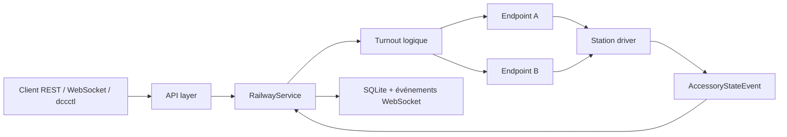

# Aiguillages et accessoires DCC

Dernière mise à jour : 2 septembre 2026.

Ce document décrit le modèle canonique des aiguillages de TrainPilot.
Il couvre les appareils simples et composés.

Les contrats machine-readable restent :

- [`../api/openapi.yaml`](../api/openapi.yaml) pour HTTP ;
- [`../api/asyncapi.yaml`](../api/asyncapi.yaml) pour les snapshots et événements ;
- [`ARCHIVE_FORMAT.md`](ARCHIVE_FORMAT.md) pour les archives de circuit.

## 1. Vocabulaire

Un `Turnout` est un appareil de voie logique.
Il possède une ou plusieurs positions ferroviaires nommées.

Un `AccessoryEndpoint` est une sortie binaire physique.
Il correspond à une adresse linéaire DCC.

Une `TurnoutPositionDefinition` associe une position logique à un vecteur
complet d'endpoints.

Exemple :

```text
position logique "left"
  A = position2
  B = position1
```

La géométrie reste dans le `Turnout`.
Les endpoints utilisent seulement `position1` et `position2`.

## 2. Adresse linéaire canonique

TrainPilot utilise une adresse d'accessoire linéaire comprise entre `1` et
`2040` inclus. Cette plage commune évite les adresses `2041..2044`, réservées
à la diffusion par DCC-EX. Cette valeur est indépendante du pilote.

Chaque pilote convertit cette adresse vers son protocole.
Il valide aussi la borne réellement supportée par ce protocole.
Il ne faut pas appliquer un décalage propre à un constructeur dans les données
TrainPilot.

Certains matériels affichent une adresse de décodeur et une sortie de 1 à 4.
D'autres affichent directement une adresse linéaire.
Un décalage par groupe de quatre peut donc apparaître.

Procédure de diagnostic :

1. commander une seule sortie connue ;
2. noter l'adresse affichée par le fabricant ;
3. vérifier sa convention de numérotation ;
4. convertir une seule fois vers l'adresse linéaire TrainPilot ;
5. ne pas ajouter un second décalage dans le pilote ou le client.

## 3. Positions binaires

Les seules valeurs physiques sont :

```text
position1
position2
```

Elles ne signifient pas directement `straight` ou `diverging`.
Le câblage détermine la géométrie obtenue.

Un endpoint peut avoir `inverted=true`.
Dans ce cas :

```text
position1 logique -> position2 envoyée au pilote
position2 logique -> position1 envoyée au pilote
```

La définition des positions métier ne change pas.
La résolution d'un retour physique applique l'inversion inverse.

## 4. Abstraction station

`station.CommandStation` reçoit une commande binaire typée :

```go
station.AccessoryCommand{
    Address:  12,
    Position: station.AccessoryPosition2,
}
```

La méthode s'appelle `SetBasicAccessory`.
Elle reste distincte d'un futur contrat d'accessoire étendu pour les signaux.
Une adresse ou une position invalide produit respectivement
`station.ErrInvalidAccessoryAddress` ou
`station.ErrInvalidAccessoryPosition`.

| Niveau | Exemple | Sens |
| --- | --- | --- |
| logique | `left`, `straight`, `route_a` | position métier du turnout |
| station | `position1`, `position2` | choix binaire indépendant de la géométrie |
| protocole z21 | `P=0`, `P=1` | choix de la sortie 1 ou 2 |
| DCC-EX | `activate=0`, `activate=1` | commande binaire à l'adresse linéaire |

Le provider facultatif `station.AccessoryStateEventProvider` publie :

- l'adresse linéaire ;
- la position binaire lorsqu'elle est connue ;
- l'état du rapport `known`, `unknown` ou `invalid` ;
- l'heure d'observation ;
- la qualité `station`, `assumed` ou `physical`.

`station` signifie que la centrale rapporte son état de fonction.
`assumed` signifie que l'état est déduit d'une commande ou d'un écho.
`physical` est réservé à un capteur mécanique réel.
Aucun de ces niveaux ne doit être promu en preuve physique sans capteur adapté.

La capability historique `accessoryControl` reste exposée pour compatibilité.
La présence de retours s'observe côté serveur par le provider facultatif ; elle
n'impose pas à un driver de fabriquer des événements.

Le simulateur expose ce provider avec une file de 64 événements.
La publication ne bloque jamais une commande. Si la file est pleine, le nouvel
événement est abandonné ; le snapshot du simulateur permet la resynchronisation.

Le pilote z21 expose le même provider. Sa qualité est toujours `station` : la
centrale confirme son état de fonction, pas la position mécanique des lames.

## 5. Modèle JSON

```json
{
  "id": "turnout-1",
  "name": "Aiguille entrée",
  "kind": "simple",
  "endpoints": [
    {
      "id": "main",
      "linearAddress": 1,
      "inverted": false
    }
  ],
  "positions": [
    {
      "id": "straight",
      "label": "Directe",
      "endpoints": { "main": "position1" }
    },
    {
      "id": "diverging",
      "label": "Déviée",
      "endpoints": { "main": "position2" }
    }
  ],
  "desiredPosition": "straight",
  "reportedPosition": "straight",
  "pending": false,
  "reportedStatus": "known",
  "reportQuality": "physical",
  "commandStatus": "succeeded"
}
```

`kind` accepte :

- `simple` ;
- `three_way` ;
- `double_slip` ;
- `single_slip` ;
- `custom`.

Le `kind` aide le domaine et l'interface graphique.
Il ne définit jamais les vecteurs valides.
La liste `positions` reste la source de vérité.

## 6. États courants

`desiredPosition` contient la position logique demandée.

`reportedPosition` contient la position résolue depuis les endpoints.
Une chaîne vide signifie que la combinaison est inconnue ou invalide.

`pending=true` signifie qu'une transition attend encore sa confirmation.

`reportedStatus` distingue `known`, `unknown` et `invalid`. `reportQuality` agrège
la confiance des endpoints. `commandStatus` vaut `idle`, `pending`,
`succeeded`, `failed` ou `timeout`.

`unknown` et `invalid` sont réservés à la qualité d'état.
Ils ne peuvent pas être déclarés comme identifiants de positions normales.

Les champs historiques suivants restent présents pour un aiguillage simple :

```text
dccAddress
desiredState
reportedState
```

Ils sont dépréciés.
Les appareils composés ne les exposent pas.

## 7. Aiguillage simple

```text
straight  -> main=position1
diverging -> main=position2
```

Un aiguillage enroulé, symétrique ou courbe reste généralement `simple`.
Ses libellés peuvent être adaptés à l'interface.

## 8. Aiguillage triple

```json
{
  "id": "T3",
  "name": "Aiguillage triple",
  "kind": "three_way",
  "endpoints": [
    { "id": "A", "linearAddress": 20 },
    { "id": "B", "linearAddress": 21 }
  ],
  "positions": [
    {
      "id": "left",
      "endpoints": { "A": "position2", "B": "position1" }
    },
    {
      "id": "straight",
      "endpoints": { "A": "position1", "B": "position1" }
    },
    {
      "id": "right",
      "endpoints": { "A": "position1", "B": "position2" }
    }
  ],
  "desiredPosition": "straight",
  "reportedPosition": "",
  "pending": false
}
```

La combinaison suivante n'est pas déclarée :

```text
A=position2, B=position2
```

Elle ne peut pas être commandée comme position logique.
Si elle est observée, `reportedPosition` reste vide.

## 9. Traversée-jonction double

Une TJD peut déclarer quatre positions génériques :

```text
route_a -> A=position1, B=position1
route_b -> A=position1, B=position2
route_c -> A=position2, B=position1
route_d -> A=position2, B=position2
```

Ces noms ne décrivent pas une géométrie universelle.
Le câblage, la motorisation et le fabricant déterminent la correspondance.
La configuration explicite doit toujours être vérifiée sur le réseau concerné.

## 10. Traversée-jonction simple

Une TJS peut avoir deux endpoints sans utiliser les quatre combinaisons.

Exemple :

```text
route_a -> A=position1, B=position1
route_b -> A=position1, B=position2
route_c -> A=position2, B=position1
```

La combinaison absente reste invalide.
Aucun traitement spécial n'est nécessaire dans le modèle.

## 11. Appareil personnalisé

`custom` accepte un nombre quelconque d'endpoints.

Exemple à trois endpoints :

```text
position one -> A=position1, B=position1, C=position1
position two -> A=position2, B=position1, C=position2
```

Chaque position doit définir tous les endpoints.
Deux positions ne peuvent pas partager le même vecteur.

## 12. Validation

Une définition est refusée si :

- l'identifiant ou le nom est vide ;
- le `kind` est inconnu ;
- aucun endpoint ou aucune position n'est défini ;
- une adresse est hors de la plage portable `1..2040` ;
- deux endpoints partagent un identifiant ou une adresse ;
- une position référence un endpoint absent ;
- une position omet un endpoint ;
- une valeur diffère de `position1` ou `position2` ;
- deux positions ont le même identifiant ;
- deux positions correspondent au même vecteur ;
- l'état demandé ou rapporté référence une position absente.

Les erreurs incluent l'identifiant de l'appareil et la cause exploitable.

## 13. Persistance et migration

Les définitions sont normalisées dans quatre ensembles :

```text
turnouts
turnout_endpoints
turnout_positions
turnout_position_endpoints
```

Les enfants utilisent des clés étrangères et `ON DELETE CASCADE`.
Les ordres des endpoints et positions sont persistés.

La migration d'une ancienne base est automatique et idempotente.
Un ancien aiguillage devient :

```text
kind=simple
endpoint main à l'ancienne adresse
straight  -> main=position1
diverging -> main=position2
```

Une ancienne valeur `unknown` devient une position rapportée vide.

## 14. Archives

Les exports utilisent le format d'archive version 3.
Ils sont déterministes pour un état et un timestamp identiques.

Les archives versions 1 et 2 restent importables.
Leur modèle à une adresse est converti en aiguillage simple.

## 15. Machine de contrôle et sécurité

Une commande logique suit cette machine d'état :

```text
commande validée
  -> desiredPosition=cible, pending=true, commandStatus=pending
  -> expansion en endpoints ordonnés
  -> attente des rapports de chaque étape
  -> cible résolue: pending=false, commandStatus=succeeded
  -> erreur driver: pending=false, commandStatus=failed
  -> délai expiré: pending=false, commandStatus=timeout
```

`reportedPosition` n'est jamais copié depuis la commande. Il est recalculé
uniquement à partir des `AccessoryStateEvent` connus. Un rapport `assumed` peut
terminer une commande, mais la qualité finale reste `assumed`.

La qualité globale est la moins fiable des qualités disponibles :

```text
assumed < station < physical
```

Deux rapports `station` donnent `station`. Un rapport `assumed` et un rapport
`station` donnent `assumed`. Seuls des rapports tous `physical` donnent
`physical`.

### Transition sûre

Le contrôleur construit un graphe générique à partir des positions déclarées.
Deux positions sont voisines si leur vecteur diffère sur exactement un
endpoint. Le chemin le plus court est parcouru dans l'ordre des positions de
la définition. Aucun traitement spécial n'examine `kind`.

Pour le triple :

```text
left A2/B1 -> straight A1/B1 -> right A1/B2
```

La combinaison interdite `A2/B2` n'est donc jamais commandée. Chaque étape est
confirmée avant la suivante. Quand l'état initial est inconnu, les endpoints
de la cible sont commandés dans l'ordre déclaré ; l'exploitant doit alors
considérer qu'aucun chemin mécanique ne peut être garanti depuis un état
inconnu.

Si aucun chemin à un endpoint par étape n'existe entre deux positions connues,
la commande échoue avec `unsafe_turnout_transition`. Une définition future
pourra expliciter des arêtes plus complexes ; la V1 ne traverse pas directement
un vecteur intermédiaire non déclaré.

### Sérialisation et confirmations obsolètes

Les commandes sont sérialisées par identifiant de turnout. Deux commandes du
même appareil ne peuvent pas entrelacer leurs endpoints. Deux appareils
indépendants restent commandables en parallèle. Les verrous sans utilisateur
sont supprimés.

Chaque commande et chaque étape possède une génération. Un rapport dont
`observedAt` précède l'étape courante peut mettre à jour l'observation
historique, mais ne peut pas confirmer la nouvelle commande. Les drivers
doivent donc fournir un timestamp d'observation fidèle.

### Timeout

`turnout.confirmationTimeout` règle le délai maximal d'une étape. Sa valeur par
défaut est `2s` et son format suit `time.ParseDuration` (`500ms`, `2s`, `1m`).
Une valeur absente utilise le défaut ; une valeur invalide, nulle ou négative
empêche le démarrage.

À expiration, `desiredPosition` reste la cible, `reportedPosition` conserve la
dernière observation, `pending` devient faux et `commandStatus` devient
`timeout`. Le serveur ne prétend jamais que la cible a été atteinte.

### Échec partiel et rollback

Si A confirme puis B échoue, les rapports réellement reçus sont conservés.
Le vecteur peut résoudre une position intermédiaire ou devenir `invalid`. Un
événement `turnout.command.failed` est publié et l'erreur est retournée au
client.

La V1 ne fait aucun rollback aveugle. Le graphe déduit des vecteurs ne constitue
pas une déclaration explicite qu'un retour est mécaniquement sûr. Une action
ultérieure de l'utilisateur est nécessaire après un échec partiel.

### Changement externe

Un changement reçu depuis une application de centrale, une commande manuelle
ou un autre client met à jour `reportedPosition` et publie
`turnout.state.changed`. Il ne modifie pas `desiredPosition` et ne relance
aucune commande automatiquement. `reportedPosition != desiredPosition` est un
état légitime.

### Événements

- `turnout.commanded` annonce la cible acceptée ;
- `turnout.state.changed` expose desired, reported, statut, pending, qualité et
  résultat de commande ;
- `turnout.command.failed` expose la cible et une raison publique stable.

Le contrat exact est dans `api/asyncapi.yaml` version `1.9.0`.

## 16. Contrat REST et CLI

`GET /api/v1/turnouts` retourne les définitions et l'état runtime. La liste
`positions` fournit les identifiants et libellés utilisables par un client.
Les vecteurs `endpoints` restent visibles. Un client de conduite peut les
ignorer.

La commande publique utilise une position logique :

```http
PUT /api/v1/turnouts/T3
Content-Type: application/json

{"position":"right"}
```

Le handler attend la confirmation de chaque étape. Il retourne `204` après la
confirmation finale. Les erreurs publiques sont stables :

| Code | HTTP | Signification |
| --- | ---: | --- |
| `turnout_not_found` | 404 | appareil inconnu |
| `invalid_turnout_position` | 400 | position absente de `positions` |
| `turnout_busy` | 409 | appareil temporairement indisponible |
| `turnout_transition_failed` | 409 | échec d'une étape |
| `turnout_confirmation_timeout` | 409 | confirmation non reçue |
| `station_offline` | 503 | centrale hors ligne |
| `station_unsupported` | 409 | pilote sans accessoires |

Le body historique `{"state":"diverging"}` reste accepté uniquement pour un
appareil `simple`. Il est déprécié. Envoyer `state` et `position` ensemble est
refusé.

```bash
dccctl turnouts
dccctl turnout T3 --positions
dccctl turnout T3 right
```

La CLI valide localement la position et affiche la liste autorisée en cas
d'erreur.

## 17. Couches logicielles



- la couche `station` transporte `position1` et `position2` ;
- la couche `model` valide les appareils et résout les vecteurs ;
- la couche `service` séquence et confirme les transitions ;
- la couche API expose les positions logiques et les états runtime.

## 18. Archives de layout

Le format courant est la version 3. Un export conserve `kind`, `endpoints`,
`positions` et les références d'itinéraire. Il ne conserve pas `pending`, la
dernière observation, la qualité ni le résultat de commande. Une importation
repart donc avec un état runtime neutre.

Les versions 1 et 2 restent importables. Un ancien objet avec `dccAddress`,
`desiredState` et `reportedState` devient un appareil `simple` avec l'endpoint
`main`.

## 19. Confirmation physique

`reportedPosition` indique ce que TrainPilot peut résoudre depuis les retours
disponibles.

Une confirmation de centrale ne garantit pas toujours la position physique des
lames.
Cette garantie exige une détection physique adaptée.

Une combinaison inconnue ne devient jamais une position inventée.
Une transition partiellement exécutée ne doit jamais être déclarée réussie.
Une ancienne confirmation ne doit pas écraser une commande récente.

Le contrôleur agrège ces niveaux sans les promouvoir. Un itinéraire qui exige
une preuve mécanique devra imposer une politique `physical` dans un futur
ticket.

## 20. Simulation et appareils composés

Le simulateur travaille uniquement au niveau des endpoints physiques. Son état
utilise `position1` et `position2`, jamais les noms logiques du turnout.

Une confirmation immédiate ou différée publie un
`station.AccessoryStateEvent` de qualité `physical`. Une injection externe peut
utiliser `station`, `assumed` ou `physical`. Elle modifie `Reported`, conserve
`Desired` et annule toute confirmation retardée devenue obsolète.

Pour un triple, le service résout les rapports reçus :

```text
A=position2, B=position1 -> left
A=position1, B=position1 -> straight
A=position1, B=position2 -> right
A=position2, B=position2 -> position rapportée vide, reportedStatus=invalid
```

Le simulateur accepte volontairement le dernier vecteur. Il décrit un état
physique possible, même s'il est interdit par la définition logique.

Un fault `accessory` peut cibler une adresse. Il permet de faire réussir A puis
échouer B sans hasard et sans rejeu.

## 21. Hors modèle

Les ponts tournants, plaques tournantes et traversers ne sont pas des
`Turnout`.

Ils ont des positions indexées nombreuses, une durée de mouvement, un
verrouillage et parfois une occupation propre.
Ils nécessitent une famille métier distincte.

## 22. Protocole accessoire z21

Le pilote convertit l'adresse linéaire canonique avec :

```text
FAdr = linearAddress - 1
linearAddress = FAdr + 1
```

Exemples de référence :

| Adresse TrainPilot | FAdr z21 |
| ---: | ---: |
| 1 | `0x0000` |
| 4 | `0x0003` |
| 5 | `0x0004` |
| 8 | `0x0007` |
| 9 | `0x0008` |
| 2040 | `0x07F7` |

Une commande `LAN_X_SET_TURNOUT` utilise `Q=1`. Le bit `P` vaut `0` pour
`position1` et `1` pour `position2`. Le bit d'activation `A` vaut d'abord `1`,
puis `0` après `station.accessoryPulse`, qui vaut `100ms` par défaut. Une
annulation cliente ne supprime pas la tentative de désactivation de sécurité.

Après l'impulsion, le pilote envoie `LAN_X_GET_TURNOUT_INFO`. Il corrèle les
réponses par `FAdr` et traite aussi les broadcasts externes. Le champ z21 `ZZ`
est interprété sans approximation :

| ZZ | État TrainPilot | Position |
| --- | --- | --- |
| `00` | `unknown` | aucune |
| `01` | `known` | `position1` |
| `10` | `known` | `position2` |
| `11` | `invalid` | aucune |

La capability `accessoryControl` du pilote z21 est active. Les paquets exacts,
les limites d'adresse, les réponses concurrentes, broadcasts, annulations et
refus hors ligne sont couverts par un faux serveur UDP. Une validation sur
centrale réelle reste requise avant de considérer l'adressage affiché par un
constructeur ou la position mécanique comme confirmés.

## 23. Protocole accessoire DCC-EX

Le pilote utilise uniquement la commande brute à adresse linéaire :

```text
position1 -> <a LINEAR_ADDRESS 0>
position2 -> <a LINEAR_ADDRESS 1>
```

Exemples :

```text
adresse 1, position1  -> <a 1 0>
adresse 1, position2  -> <a 1 1>
adresse 44, position1 -> <a 44 0>
adresse 44, position2 -> <a 44 1>
```

DCC-EX accepte officiellement les adresses linéaires `1..2044`. TrainPilot
applique sa plage portable commune `1..2040`. Les adresses `0` et `2041..2044`
sont donc refusées avant toute écriture TCP.

Le pilote n'utilise pas la forme `addr/subaddr` et ne force plus
`subaddr=0`. Certains systèmes affichent toutefois l'adresse du décodeur et sa
sortie dans un groupe de quatre. Par exemple, DCC-EX documente l'adresse
linéaire 44 comme l'adresse 11, sous-adresse 3. En cas de décalage, appliquer la
procédure de diagnostic de la section 2 et conserver une seule conversion.

TrainPilot ne crée ni ne modifie automatiquement de définition persistante
`<T>`. Cette décision évite les collisions d'IDs, un état EEPROM divergent et
la duplication du modèle des triples ou TJD dans la centrale. Le driver reçoit
seulement des commandes indépendantes pour leurs endpoints.

La documentation DCC-EX précise que `<a>` envoie un paquet DCC sans conserver
l'état courant de l'accessoire. Une écriture TCP réussie publie donc un
`AccessoryStateEvent` de qualité `assumed`. Ce niveau permet au service de
fonctionner sans capteur, mais ne prouve pas que le décodeur a reçu le paquet
ou que les lames ont bougé. Aucun parser de changement externe n'est ajouté :
la commande brute ne possède pas de réponse ou broadcast d'état standard
documenté. Une future confirmation physique devra venir d'un capteur adapté.

## 24. Matrice de capacités et conformité commune

Le client utilise toujours le modèle logique `Turnout` et la capability
`accessoryControl`. Il ne doit pas déduire une confirmation physique à partir
du nom du driver. La qualité du retour porte cette information.

| Capacité | Simulator | z21 UDP | DCC-EX TCP |
| --- | --- | --- | --- |
| commande binaire `position1` / `position2` | oui | oui | oui |
| plage portable `1..2040` | oui | oui | oui |
| retour `physical` | oui, par défaut ou injection | non | non |
| retour `station` | injectable | oui, interrogation ou broadcast | non |
| retour `assumed` | injectable | non | oui, après écriture réussie |
| changement externe observable | oui | oui, broadcast z21 | non avec `<a>` |
| refus hors ligne | oui | oui | oui dès que le socket manque |
| reprise de disponibilité | connectivité injectable | première réponse valide | reconnexion TCP automatique |
| rejeu d'une commande refusée | jamais | jamais | jamais |

`internal/station/contracttest.BasicAccessoryContract` vérifie le sous-ensemble
commun sur les trois drivers : positions binaires, bornes, valeur invalide,
état hors ligne, retour en ligne sans rejeu et cent commandes concurrentes sur
vingt adresses. Les faux serveurs UDP/TCP rendent cette suite indépendante du
matériel.

Les mêmes fixtures `simple`, `three_way`, `double_slip` et `single_slip`
traversent ensuite le contrôleur métier avec chaque driver. Les tests couvrent
les quatre positions de la TJD, toutes leurs transitions, les trois positions
du triple, sa quatrième combinaison physique interdite, les erreurs partielles,
les confirmations absentes ou incorrectes, l'annulation et la perte de
centrale. Les changements externes sont testés avec Simulator et z21. DCC-EX
n'en annonce pas, conformément au protocole `<a>`.

Le WebSocket reste indépendant du driver : `turnout.commanded`,
`turnout.state.changed` et `turnout.command.failed` proviennent du service. Les
tests HTTP/WebSocket génériques emploient le Simulator. Deux tests bout en bout
supplémentaires passent par les faux transports z21 et DCC-EX : une commande
HTTP de triple doit produire sur le WebSocket la position terminale et la
qualité `station` ou `assumed` propre au driver.

## 25. Validation matérielle

Les faux transports prouvent le contrat logiciel, mais pas le câblage, le
mouvement mécanique, la convention d'adresse affichée ni l'échauffement. La
campagne reproductible est décrite dans
[`hardware-tests/turnouts/README.md`](hardware-tests/turnouts/README.md).

Elle fournit :

- `scripts/test-turnouts.sh`, interactif et inactif sans autorisation explicite ;
- des essais d'adresse autour des groupes de quatre ;
- les pulses z21 `50ms`, `100ms` et `150ms` ;
- le retour z21 et les changements provenant d'un autre client ;
- la limite DCC-EX `assumed` et l'absence de retour externe supposé ;
- la coupure/reconnexion avec vingt secondes d'observation sans rejeu ;
- les séquences triple/TJD, l'échec partiel et l'endurance ;
- des modèles de fiches z21 et DCC-EX initialisés à `NOT_TESTED`.

En l'absence de fiche datée remplie, le support accessoire matériel reste
« implémenté et vérifié par fakes », pas « validé sur le matériel ». Un retour
z21 de qualité `station` ne doit jamais être présenté comme une détection
physique des lames.

## 26. Cas particuliers et limites

Cette section fige les limites du modèle avant ses prochaines extensions.
Les vecteurs déclarés restent la seule source de vérité. Le `kind`, le nom du
matériel et le pilote ne créent aucune position implicite.

### Motorisations simples et inversion

Un aiguillage simple à double bobine, moteur lent ou servodécodeur utilise le
même modèle : un endpoint et deux positions. La technologie de motorisation
n'appartient pas au vecteur logique. `inverted=true` adapte un câblage inversé
sans renommer `straight`, `diverging` ou les libellés du client.

Les décodeurs à impulsion sont une politique de driver. La z21 active la sortie
avec `Q=1`, attend `station.accessoryPulse`, puis la désactive. Le modèle logique
ne contient ni durée, ni commande `off`. Un décodeur bistable peut adopter une
autre politique de driver plus tard sans modifier `Turnout`.

### Appareils composés

Un triple possède généralement deux endpoints, donc quatre vecteurs
électriques. Seuls trois vecteurs sont déclarés. Le quatrième reste
incommandable et se résout en `reportedStatus=invalid` s'il est observé. Un
passage `left -> right` traverse une position déclarée à une seule variation
d'endpoint. Chaque étape attend sa confirmation. Un échec partiel conserve le
vecteur réellement observé et n'entraîne aucun rollback aveugle.

Une TJD peut être couplée ou indépendante. Elle peut exposer quatre vecteurs,
un sous-ensemble, et des noms propres au réseau. `double_slip` n'impose ni deux
positions, ni les identifiants `route_a` à `route_d`, ni une géométrie de
fabricant. Une TJS suit la même règle : les combinaisons absentes et les
positions non déclarées sont interdites.

Deux aiguillages couplés ou un crossover peuvent être représentés par un
`custom` multi-endpoints. Ce choix décrit leur commande commune. Une future
topologie pourra préférer deux objets reliés, sans modifier le contrat des
endpoints.

### Origine et qualité des confirmations

| Source | Rapport disponible | Qualité | Garantie |
| --- | --- | --- | --- |
| Simulator | confirmation ou injection | `physical` par défaut, qualité injectable | état déterministe choisi par le test |
| z21 `TURNOUT_INFO` | position de fonction | `station` | état vu par la centrale, pas mouvement des lames |
| DCC-EX `<a>` | écriture TCP réussie | `assumed` | commande envoyée, sans accusé physique |
| futur capteur de fin de course | position mécanique | `physical` | dépendra du capteur et de son mapping |

Une écriture TCP, un écho de centrale et un capteur mécanique ne sont donc pas
équivalents. Les clients doivent afficher `reportQuality` et ne jamais déduire
une preuve physique du driver utilisé.

### État inconnu, redémarrage et transition

`reportedPosition=""` avec `reportedStatus=unknown` représente une absence
d'information. Avec `reportedStatus=invalid`, il représente un vecteur complet
qui ne correspond à aucune position. `pending=true` reste séparé de ces deux
cas. Aucun de ces états ne sélectionne une position valide par défaut.

Après redémarrage, un turnout peut donc rester inconnu. TrainPilot n'envoie
aucune commande pour fabriquer un état. La z21 peut être interrogée. DCC-EX
reste `assumed` après une écriture réussie, ou `unknown` avant toute observation.
Une action explicite de l'utilisateur est nécessaire pour changer la voie.

### Verrous de configuration et adresses partagées

Une définition ne peut pas être remplacée ou supprimée pendant que son
`pending` est actif. Un import `merge` qui modifie cet appareil, ou un import
`replace` qui pourrait le supprimer, retourne HTTP `409` avec
`turnout_configuration_pending`. Un import sans rapport avec cet appareil reste
autorisé. Le contrôle et la mutation sont exécutés dans la même transaction
SQLite.

Une adresse linéaire appartient à un seul turnout logique. Un import qui
attribue la même adresse à deux appareils retourne HTTP `409` avec
`accessory_address_conflict`, sans modification partielle. Le partage implicite
est interdit afin d'éviter deux autorités concurrentes. Un couplage voulu doit
être modélisé par plusieurs endpoints d'un même `custom`.

### Équipements exclus

Un pont tournant ou une plaque tournante n'est pas un turnout. Il possède de
nombreuses positions indexées, une durée de rotation, une voie mobile, des
verrous et parfois sa propre occupation. Un traverser possède les mêmes besoins
avec un déplacement linéaire. Ces équipements auront un modèle métier dédié ;
ils ne doivent pas être simulés par une liste artificielle de positions de
turnout.
